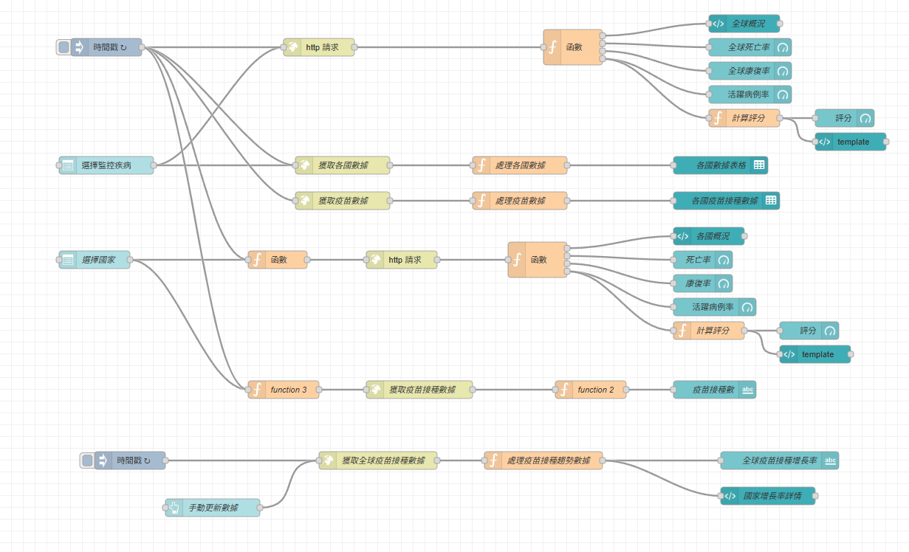

# 疾病可視化儀表板 (Node-RED)

本專案是一個基於 **Node-RED** 的疫情數據可視化儀表板，串接 [disease.sh API](https://disease.sh/)，
即時顯示 COVID-19 的全球與各國疫情資訊，包括確診數、死亡數、康復數、疫苗接種數，
以及基於活躍病例率的風險評分。

## 功能特色
- **全球疫情總覽**：確診、死亡、康復、活躍病例數
- **各國疫情比較**：前 10 大確診國數據表格與統計
- **台灣疫情概況**：本地數據即時顯示
- **疫苗接種數據**：各國最新接種情況
- **風險評分與建議**：依活躍病例率自動計算風險等級，並給出防疫建議

## 系統架構
- **Node-RED Flow (JSON)**：用於流程設計與資料流控制
- **HTTP Request nodes**：串接 `disease.sh` API
- **Function nodes (JavaScript)**：計算死亡率、康復率、風險評分
- **Dashboard nodes (ui_template, ui_gauge, ui_table)**：資料視覺化



## 安裝與使用
1. 安裝 Node-RED（若尚未安裝）：
    ```bash
    npm install -g --unsafe-perm node-red
    ```
2. 啟動 Node-RED：
    ```bash
    node-red
    ```
3.  開啟瀏覽器進入 http://localhost:1880

4.  匯入 flows.json：
 - 點選右上角選單 → Import
 - 貼上 flows.json 內容
 - 按下 Deploy 即可

## 專案結構
    ```bash
    disease-visualization-dashboard/
    │── README.md          # 說明文件
    │── flows.json         # Node-RED Flow (疾病可視化儀表板.json)
    │── screenshots/       # 儀表板畫面截圖
    │   ├── global_view.png
    │   ├── country_view.png
    │── docs/
    │   └── architecture.png   # Flow 架構截圖
    ```
## 使用技術
 - Node-RED
 - JavaScript (for Function nodes)
 - Disease.sh API
 - Node-RED Dashboard (ui_template / ui_gauge / ui_table)